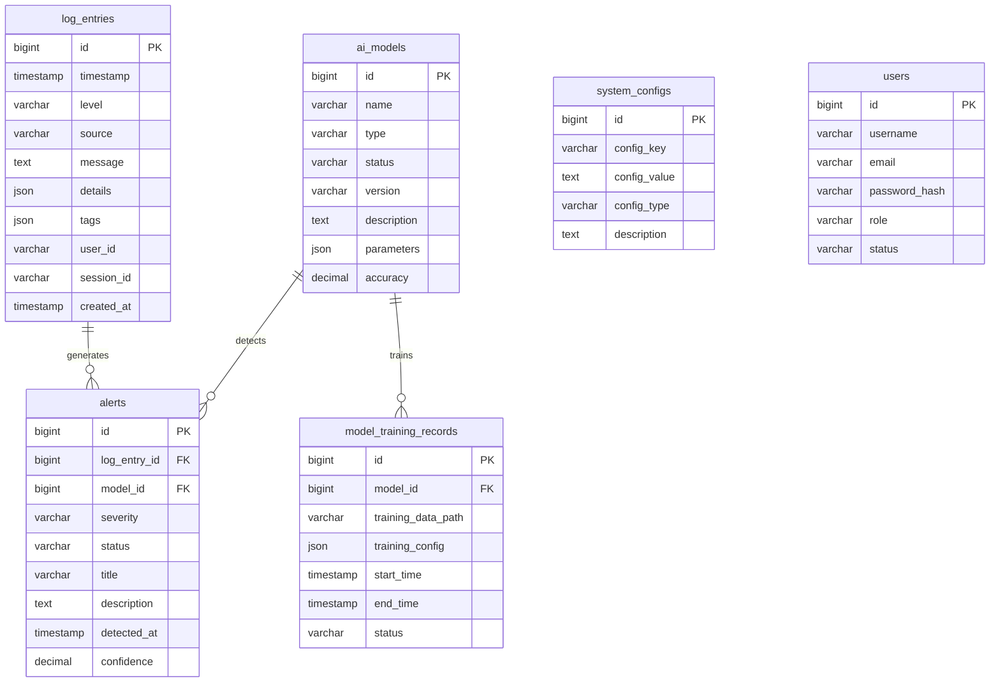

# 数据库设计文档

## 1. 数据库概述

### 1.1 数据库选择
- 当前: MySQL 8.0
- 后期迁移: 达梦数据库 (DM8)
- 字符集: utf8mb4
- 排序规则: utf8mb4_unicode_ci

### 1.2 设计原则
- 遵循第三范式，避免数据冗余
- 合理使用索引提高查询性能
- 预留扩展字段支持未来需求
- 支持软删除，保留历史数据

## 2. 核心表结构

### 2.1 日志表 (log_entries)
```sql
CREATE TABLE log_entries (
    id BIGINT PRIMARY KEY AUTO_INCREMENT COMMENT '主键ID',
    timestamp TIMESTAMP NOT NULL COMMENT '日志时间戳',
    level VARCHAR(20) NOT NULL COMMENT '日志级别: INFO, WARN, ERROR, DEBUG',
    source VARCHAR(100) NOT NULL COMMENT '日志来源',
    message TEXT NOT NULL COMMENT '日志消息',
    details JSON COMMENT '详细信息(JSON格式)',
    tags JSON COMMENT '标签列表',
    user_id VARCHAR(50) COMMENT '用户ID',
    session_id VARCHAR(100) COMMENT '会话ID',
    ip_address VARCHAR(45) COMMENT 'IP地址',
    user_agent TEXT COMMENT '用户代理',
    created_at TIMESTAMP DEFAULT CURRENT_TIMESTAMP COMMENT '创建时间',
    updated_at TIMESTAMP DEFAULT CURRENT_TIMESTAMP ON UPDATE CURRENT_TIMESTAMP COMMENT '更新时间',
    deleted_at TIMESTAMP NULL COMMENT '删除时间',
    
    INDEX idx_timestamp (timestamp),
    INDEX idx_level (level),
    INDEX idx_source (source),
    INDEX idx_user_id (user_id),
    INDEX idx_created_at (created_at),
    INDEX idx_deleted_at (deleted_at)
) ENGINE=InnoDB DEFAULT CHARSET=utf8mb4 COLLATE=utf8mb4_unicode_ci COMMENT='日志条目表';
```

### 2.2 异常预警表 (alerts)
```sql
CREATE TABLE alerts (
    id BIGINT PRIMARY KEY AUTO_INCREMENT COMMENT '主键ID',
    log_entry_id BIGINT NOT NULL COMMENT '关联日志ID',
    severity VARCHAR(20) NOT NULL COMMENT '严重程度: LOW, MEDIUM, HIGH, CRITICAL',
    status VARCHAR(20) NOT NULL DEFAULT 'PENDING' COMMENT '状态: PENDING, RESOLVED, IGNORED',
    title VARCHAR(200) NOT NULL COMMENT '预警标题',
    description TEXT COMMENT '预警描述',
    detected_at TIMESTAMP NOT NULL COMMENT '检测时间',
    resolved_at TIMESTAMP NULL COMMENT '解决时间',
    model_id BIGINT COMMENT '检测模型ID',
    confidence DECIMAL(5,4) COMMENT '置信度(0-1)',
    false_positive BOOLEAN DEFAULT FALSE COMMENT '是否误报',
    resolution_notes TEXT COMMENT '解决备注',
    created_at TIMESTAMP DEFAULT CURRENT_TIMESTAMP COMMENT '创建时间',
    updated_at TIMESTAMP DEFAULT CURRENT_TIMESTAMP ON UPDATE CURRENT_TIMESTAMP COMMENT '更新时间',
    deleted_at TIMESTAMP NULL COMMENT '删除时间',
    
    FOREIGN KEY (log_entry_id) REFERENCES log_entries(id) ON DELETE CASCADE,
    FOREIGN KEY (model_id) REFERENCES ai_models(id) ON DELETE SET NULL,
    INDEX idx_severity (severity),
    INDEX idx_status (status),
    INDEX idx_detected_at (detected_at),
    INDEX idx_model_id (model_id),
    INDEX idx_created_at (created_at)
) ENGINE=InnoDB DEFAULT CHARSET=utf8mb4 COLLATE=utf8mb4_unicode_ci COMMENT='异常预警表';
```

### 2.3 AI模型表 (ai_models)
```sql
CREATE TABLE ai_models (
    id BIGINT PRIMARY KEY AUTO_INCREMENT COMMENT '主键ID',
    name VARCHAR(100) NOT NULL COMMENT '模型名称',
    type VARCHAR(50) NOT NULL COMMENT '模型类型: ISOLATION_FOREST, LSTM, TRANSFORMER',
    status VARCHAR(20) NOT NULL DEFAULT 'TRAINING' COMMENT '状态: TRAINING, READY, ERROR, DEPRECATED',
    version VARCHAR(20) NOT NULL COMMENT '模型版本',
    description TEXT COMMENT '模型描述',
    file_path VARCHAR(500) COMMENT '模型文件路径',
    parameters JSON COMMENT '模型参数',
    accuracy DECIMAL(5,4) COMMENT '准确率',
    precision_score DECIMAL(5,4) COMMENT '精确率',
    recall_score DECIMAL(5,4) COMMENT '召回率',
    f1_score DECIMAL(5,4) COMMENT 'F1分数',
    training_data_size INT COMMENT '训练数据量',
    training_duration INT COMMENT '训练时长(秒)',
    last_trained_at TIMESTAMP NULL COMMENT '最后训练时间',
    created_at TIMESTAMP DEFAULT CURRENT_TIMESTAMP COMMENT '创建时间',
    updated_at TIMESTAMP DEFAULT CURRENT_TIMESTAMP ON UPDATE CURRENT_TIMESTAMP COMMENT '更新时间',
    deleted_at TIMESTAMP NULL COMMENT '删除时间',
    
    UNIQUE KEY uk_name_version (name, version),
    INDEX idx_type (type),
    INDEX idx_status (status),
    INDEX idx_created_at (created_at)
) ENGINE=InnoDB DEFAULT CHARSET=utf8mb4 COLLATE=utf8mb4_unicode_ci COMMENT='AI模型表';
```

### 2.4 模型训练记录表 (model_training_records)
```sql
CREATE TABLE model_training_records (
    id BIGINT PRIMARY KEY AUTO_INCREMENT COMMENT '主键ID',
    model_id BIGINT NOT NULL COMMENT '模型ID',
    training_data_path VARCHAR(500) NOT NULL COMMENT '训练数据路径',
    training_config JSON COMMENT '训练配置',
    start_time TIMESTAMP NOT NULL COMMENT '开始时间',
    end_time TIMESTAMP NULL COMMENT '结束时间',
    status VARCHAR(20) NOT NULL DEFAULT 'RUNNING' COMMENT '状态: RUNNING, COMPLETED, FAILED',
    error_message TEXT COMMENT '错误信息',
    metrics JSON COMMENT '训练指标',
    created_at TIMESTAMP DEFAULT CURRENT_TIMESTAMP COMMENT '创建时间',
    
    FOREIGN KEY (model_id) REFERENCES ai_models(id) ON DELETE CASCADE,
    INDEX idx_model_id (model_id),
    INDEX idx_start_time (start_time),
    INDEX idx_status (status)
) ENGINE=InnoDB DEFAULT CHARSET=utf8mb4 COLLATE=utf8mb4_unicode_ci COMMENT='模型训练记录表';
```

### 2.5 系统配置表 (system_configs)
```sql
CREATE TABLE system_configs (
    id BIGINT PRIMARY KEY AUTO_INCREMENT COMMENT '主键ID',
    config_key VARCHAR(100) NOT NULL COMMENT '配置键',
    config_value TEXT COMMENT '配置值',
    config_type VARCHAR(20) NOT NULL DEFAULT 'STRING' COMMENT '配置类型: STRING, NUMBER, BOOLEAN, JSON',
    description VARCHAR(500) COMMENT '配置描述',
    is_system BOOLEAN DEFAULT FALSE COMMENT '是否系统配置',
    created_at TIMESTAMP DEFAULT CURRENT_TIMESTAMP COMMENT '创建时间',
    updated_at TIMESTAMP DEFAULT CURRENT_TIMESTAMP ON UPDATE CURRENT_TIMESTAMP COMMENT '更新时间',
    
    UNIQUE KEY uk_config_key (config_key),
    INDEX idx_config_type (config_type)
) ENGINE=InnoDB DEFAULT CHARSET=utf8mb4 COLLATE=utf8mb4_unicode_ci COMMENT='系统配置表';
```

### 2.6 用户表 (users)
```sql
CREATE TABLE users (
    id BIGINT PRIMARY KEY AUTO_INCREMENT COMMENT '主键ID',
    username VARCHAR(50) NOT NULL COMMENT '用户名',
    email VARCHAR(100) NOT NULL COMMENT '邮箱',
    password_hash VARCHAR(255) NOT NULL COMMENT '密码哈希',
    full_name VARCHAR(100) COMMENT '全名',
    role VARCHAR(20) NOT NULL DEFAULT 'VIEWER' COMMENT '角色: ADMIN, OPERATOR, VIEWER',
    status VARCHAR(20) NOT NULL DEFAULT 'ACTIVE' COMMENT '状态: ACTIVE, INACTIVE, LOCKED',
    last_login_at TIMESTAMP NULL COMMENT '最后登录时间',
    created_at TIMESTAMP DEFAULT CURRENT_TIMESTAMP COMMENT '创建时间',
    updated_at TIMESTAMP DEFAULT CURRENT_TIMESTAMP ON UPDATE CURRENT_TIMESTAMP COMMENT '更新时间',
    deleted_at TIMESTAMP NULL COMMENT '删除时间',
    
    UNIQUE KEY uk_username (username),
    UNIQUE KEY uk_email (email),
    INDEX idx_role (role),
    INDEX idx_status (status)
) ENGINE=InnoDB DEFAULT CHARSET=utf8mb4 COLLATE=utf8mb4_unicode_ci COMMENT='用户表';
```

## 3. 关系图



## 4. 索引策略

### 4.1 主键索引
- 所有表都使用自增主键
- 主键自动创建聚簇索引

### 4.2 唯一索引
- 用户名、邮箱等唯一字段
- 复合唯一索引：模型名称+版本

### 4.3 普通索引
- 查询频繁的字段：时间戳、状态、级别等
- 外键字段自动创建索引

### 4.4 复合索引
- 多条件查询：用户ID+状态、时间范围+级别等
- 覆盖索引：包含查询所需的所有字段

### 4.5 JSON字段索引
- MySQL JSON字段不能直接创建全文索引
- 需要使用虚拟列或函数索引
- 示例：`CREATE INDEX idx_details_path ON log_entries((CAST(details->'$.userId' AS CHAR(50))))`

#### JSON字段索引示例
```sql
-- 为JSON字段中的特定路径创建索引
CREATE INDEX idx_log_user_id ON log_entries((CAST(details->'$.userId' AS CHAR(50))));
CREATE INDEX idx_log_login_time ON log_entries((CAST(details->'$.loginTime' AS DATETIME)));

-- 为JSON数组字段创建索引
CREATE INDEX idx_log_tags ON log_entries((CAST(JSON_EXTRACT(tags, '$[0]') AS CHAR(50))));

-- 如果需要全文搜索JSON内容，使用虚拟列
ALTER TABLE log_entries ADD COLUMN details_text TEXT 
GENERATED ALWAYS AS (JSON_UNQUOTE(JSON_EXTRACT(details, '$'))) STORED;
ALTER TABLE log_entries ADD FULLTEXT(details_text);
```

## 5. 分区策略

### 5.1 日志表分区
```sql
-- 按时间分区，每月一个分区
ALTER TABLE log_entries 
PARTITION BY RANGE (UNIX_TIMESTAMP(timestamp)) (
    PARTITION p202401 VALUES LESS THAN (UNIX_TIMESTAMP('2024-02-01')),
    PARTITION p202402 VALUES LESS THAN (UNIX_TIMESTAMP('2024-03-01')),
    -- ... 更多分区
    PARTITION p_future VALUES LESS THAN MAXVALUE
);
```

### 5.2 预警表分区
```sql
-- 按检测时间分区
ALTER TABLE alerts 
PARTITION BY RANGE (UNIX_TIMESTAMP(detected_at)) (
    PARTITION p202401 VALUES LESS THAN (UNIX_TIMESTAMP('2024-02-01')),
    PARTITION p202402 VALUES LESS THAN (UNIX_TIMESTAMP('2024-03-01')),
    -- ... 更多分区
    PARTITION p_future VALUES LESS THAN MAXVALUE
);
```

## 6. 数据清理策略

### 6.1 日志数据保留
- 原始日志：保留90天
- 异常日志：保留1年
- 定期清理过期数据

### 6.2 模型数据管理
- 保留最新3个版本的模型
- 删除过期的训练记录
- 定期清理临时文件

## 7. 达梦数据库迁移

### 7.1 数据类型映射
| MySQL | 达梦数据库 |
|-------|-----------|
| BIGINT | BIGINT |
| VARCHAR | VARCHAR |
| TEXT | CLOB |
| JSON | JSON |
| TIMESTAMP | TIMESTAMP |
| DECIMAL | DECIMAL |

### 7.2 语法差异
- 自增主键：`AUTO_INCREMENT` → `IDENTITY`
- 索引创建：语法略有差异
- 分区语法：需要调整

### 7.3 迁移脚本
```sql
-- 达梦数据库建表脚本示例
CREATE TABLE log_entries (
    id BIGINT IDENTITY(1,1) PRIMARY KEY,
    timestamp TIMESTAMP NOT NULL,
    level VARCHAR(20) NOT NULL,
    -- ... 其他字段
);
```

## 8. 性能优化建议

### 8.1 查询优化
- 使用合适的索引
- 避免SELECT *
- 使用LIMIT分页
- 合理使用JOIN

### 8.2 写入优化
- 批量插入
- 使用事务
- 合理设置缓冲区

### 8.3 监控指标
- 查询响应时间
- 索引使用率
- 锁等待时间
- 连接池状态
